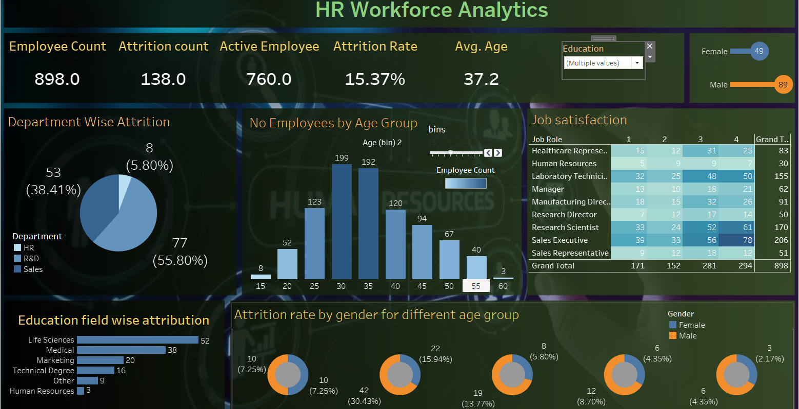

# HR Workforce Analytics Dashboard

This Tableau dashboard provides an in-depth analysis of employee attrition and workforce trends within an organization. It is designed to support HR teams in understanding key metrics like employee distribution, attrition drivers, and satisfaction levels by role, department, and demographic groups.

---

## 📊 Dashboard Overview

The dashboard includes the following key insights:

- **Employee Metrics**
  - Total Employees: 898
  - Attrition Count: 138
  - Active Employees: 760
  - Attrition Rate: 15.37%
  - Average Employee Age: 37.2

- **Visualizations**
  - **Department-Wise Attrition** (Pie chart)
  - **No. of Employees by Age Group** (Histogram)
  - **Job Satisfaction Matrix** (Heatmap by Job Role & Rating)
  - **Education Field-Wise Attrition** (Horizontal bar chart)
  - **Attrition Rate by Gender and Age Group** (Donut charts)

---

## 🧩 Filters Available

The dashboard includes interactive filters for:
- **Education Field**
- **Gender**
- **Age Group (Bins)**

These allow users to explore attrition patterns across various employee segments.

---

## 🖼️ Dashboard Preview

---

## 💾 File Included

- `hr_workforce_analytics_dashboard.twbx`: Tableau Packaged Workbook (includes data and visuals)

---

## 🛠 Tools Used

- Tableau Desktop
- Excel (Data Source)

---

## 📌 Use Cases

This dashboard is helpful for:
- HR departments tracking attrition trends
- Workforce planning and strategy
- Identifying risk areas for employee turnover
- Analyzing satisfaction levels by job role

---

Thanks for visiting the project! ⭐
